<div align="center">

# NORDMAR *atelier*

**A cinematic, scroll-driven landing page for a bespoke kitchen studio.**
Built with React and plain CSS — no animation libraries, no canvas, no WebGL.


### [**→ Live demo**](https://andresazcona.github.io/nordmar-kitchens/)

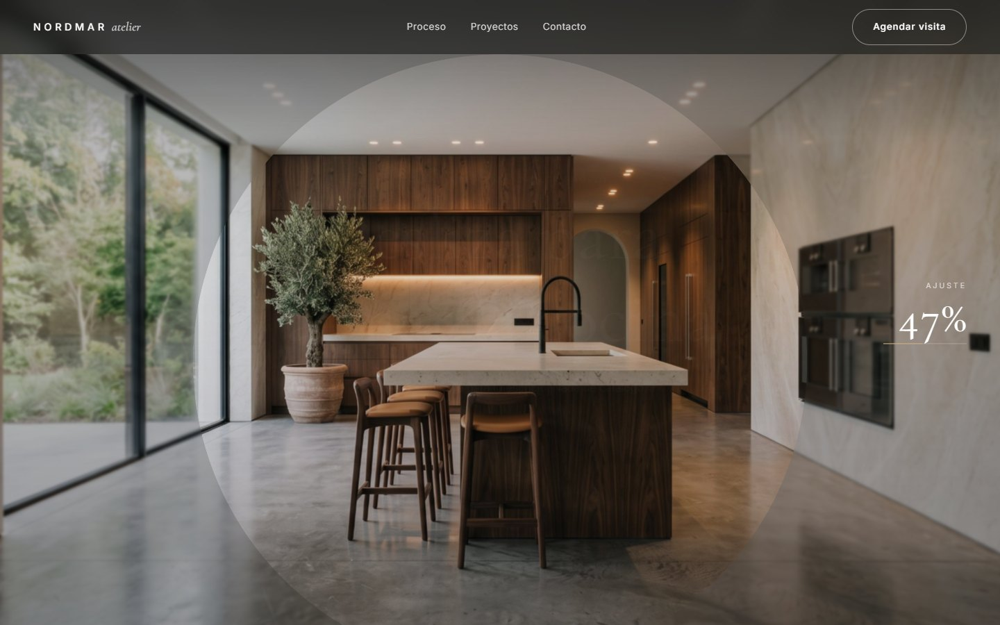

</div>

---

## Overview

Nordmar Atelier is a fictional high-end kitchen brand. The goal of the project was to see how far a
"cinematic" marketing site can go using only **React state + modern CSS**, without reaching for
GSAP, Framer Motion, Three.js or a canvas.

The core idea: **the visitor builds the kitchen by scrolling.** The page opens on an empty room;
scrolling grows the finished kitchen out of the center of the space, then hands control to a live
material configurator where every swap is a real state change, not a video.

All imagery was generated with **Gemini** using a single-camera editing workflow (see
[Image pipeline](#image-pipeline)), so every material variant lines up pixel-perfect with the empty room.

## Highlights

| | Feature | How |
|---|---|---|
| 🏗️ | **Scroll-to-build hero** | Sticky stage + scroll progress written to a CSS variable; the kitchen layer is revealed with an expanding `clip-path: circle()` |
| 📏 | **Live "fit" meter** | 0 → 100 % counter and progress line driven by the same scroll value, updated without React re-renders |
| 🎨 | **Material configurator** | 4 finishes; the new one opens as a circle **from the exact button you clicked**, specs update with it |
| ✍️ | **Masked headline reveals** | Words rise out of overflow masks with staggered delays, on load and on viewport entry |
| 🔢 | **Count-up stats & marquee** | `requestAnimationFrame` easing for numbers, infinite CSS marquee that pauses on hover |
| 🃏 | **3D tilt cards** | Pointer position → `rotateX/rotateY` custom properties, perspective rise-in on reveal |
| 🖼️ | **Filterable portfolio** | Curtain `clip-path` reveal replayed on every filter change, scroll-linked parallax via `animation-timeline: view()` |
| 🪟 | **Popups everywhere** | Native `<dialog>` for project details, process steps and a contact form; bottom-sheet on mobile |
| 📱 | **Responsive by design** | Full-screen mobile menu, swipeable material picker, single-column form with 16 px inputs (no iOS zoom) |
| ♿ | **Accessible defaults** | `prefers-reduced-motion` support, radio-group semantics in the picker, keyboard/Esc-friendly modals |

## Screenshots

### Desktop

| Scroll to build | Live configurator |
|---|---|
| 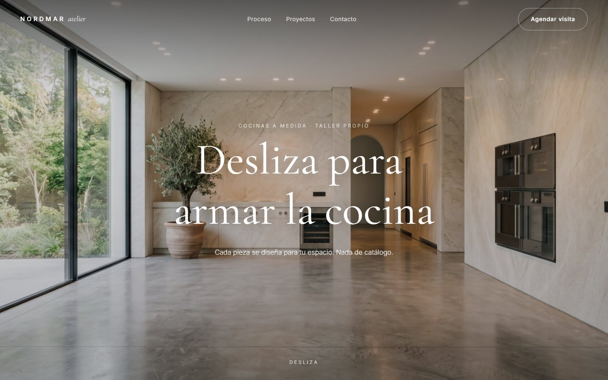 | 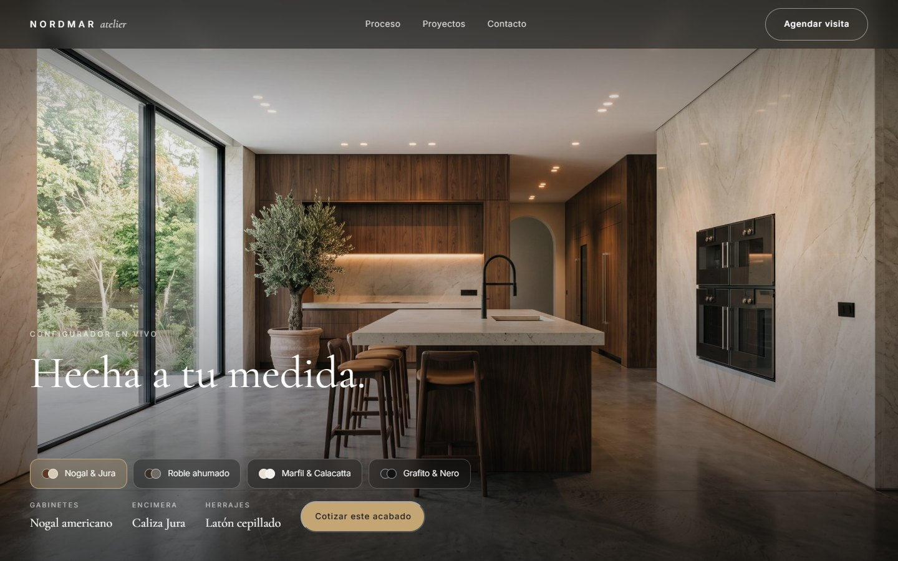 |
| **Material swap (Graphite & Nero)** | **Process — 3D tilt cards** |
| 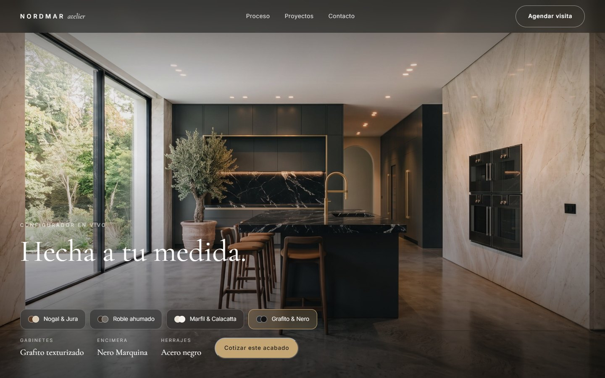 | 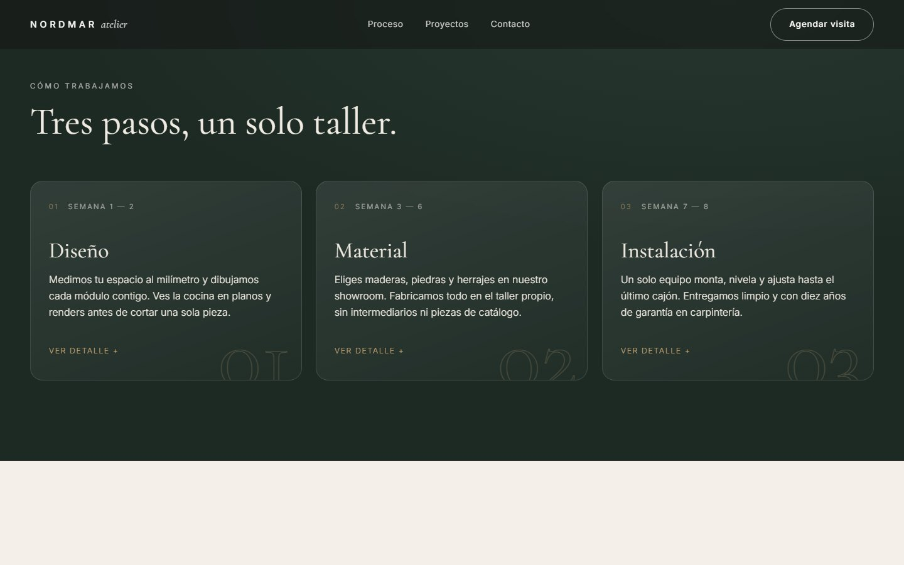 |
| **Filterable portfolio** | **Project popup** |
| 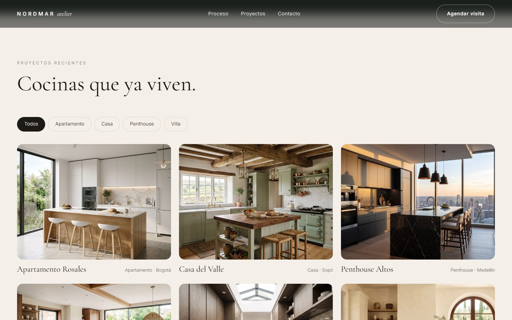 | 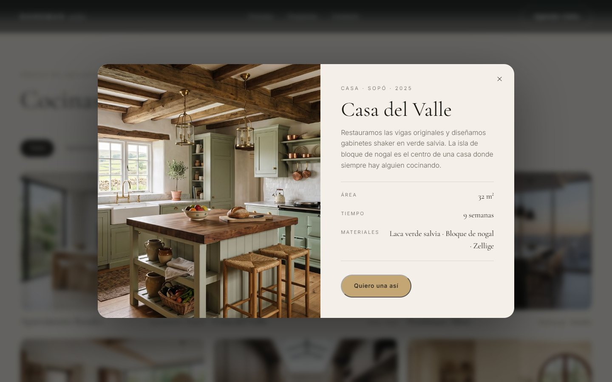 |

<p align="center">
  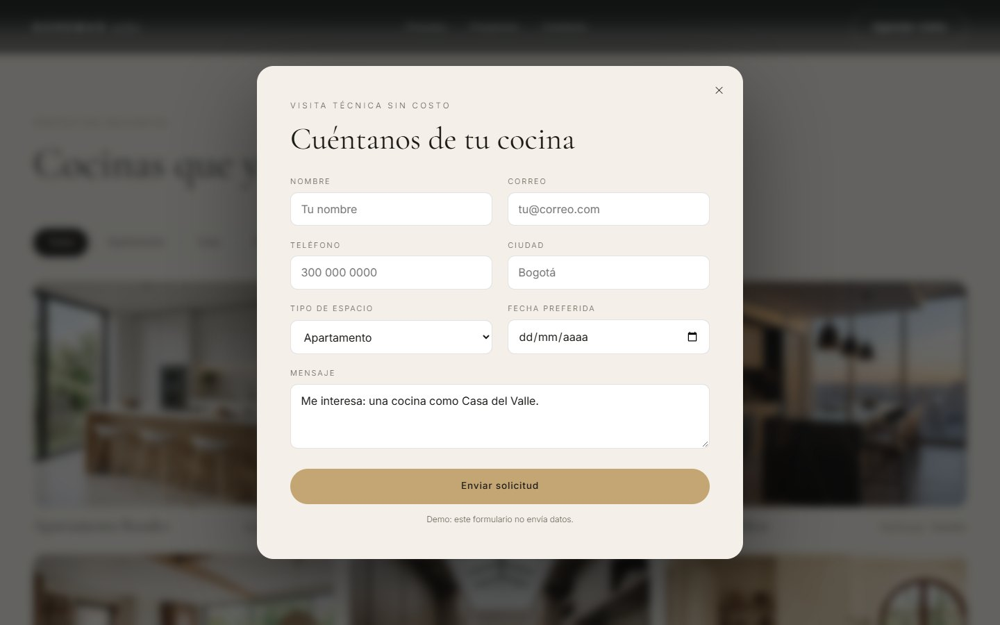
  <br /><sub>Contact form — pre-filled with the project or finish the visitor came from</sub>
</p>

### Mobile

<p align="center">
  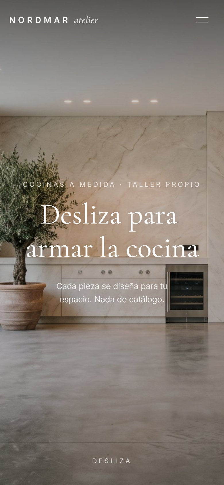
  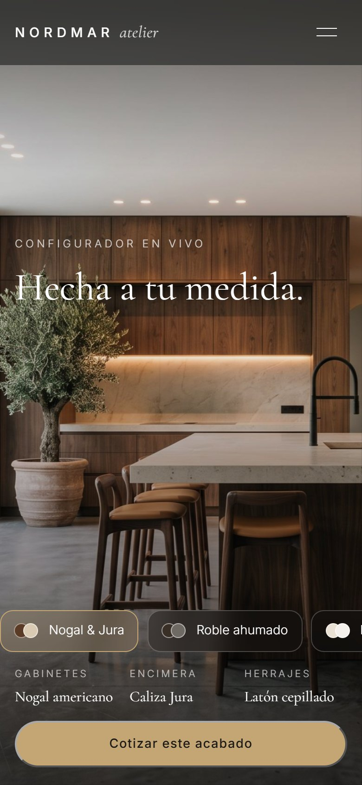
  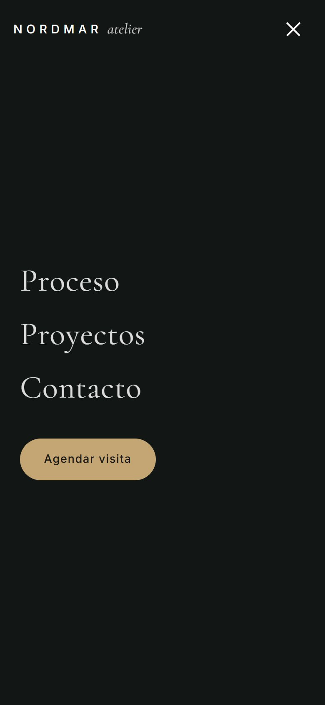
  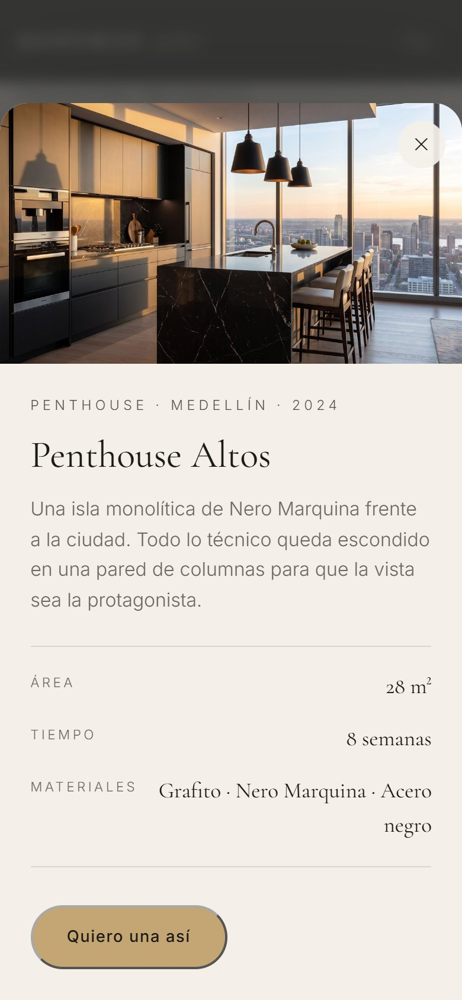
</p>

## How the animations work

### 1. Scroll progress as a CSS variable

The hero is `320vh` tall with a `position: sticky` stage inside. One passive, `requestAnimationFrame`-throttled
scroll listener computes progress `p ∈ [0, 1]` and writes it straight to the DOM — React never re-renders per frame:

```js
const p = Math.min(1, Math.max(0, -el.getBoundingClientRect().top / total))
el.style.setProperty('--p', p.toFixed(4))
```

Everything else is derived in CSS:

```css
.hero {
  --fill: clamp(0, calc((var(--p) - 0.08) * 2), 1);   /* kitchen growth   */
  --late: clamp(0, calc((var(--p) - 0.55) * 5), 1);   /* final UI fade-in */
}
.hero__kitchen { clip-path: circle(calc(var(--fill) * 85%) at 50% 58%); }
.hero__empty   { filter: brightness(calc(1 - var(--fill) * .4)) blur(calc(var(--fill) * 4px)); }
.hero__intro   { opacity: clamp(0, calc(1 - var(--p) * 3.5), 1); }
```

### 2. Circular wipe from the clicked button

On click, the button's center is stored as `--cx / --cy`; the previous finish stays underneath while the new
one animates its `clip-path` from a zero-radius circle at that point:

```css
@keyframes wipe {
  from { clip-path: circle(0    at var(--cx) var(--cy)); transform: scale(1.08); }
  to   { clip-path: circle(150% at var(--cx) var(--cy)); transform: scale(1); }
}
```

### 3. One observer for every reveal

A single `IntersectionObserver` adds `.is-visible` to any `.reveal` element once and then stops watching it.
Masked titles, blur-lift sections, perspective cards and the count-up stats all hang off that one class.

### 4. Parallax with progressive enhancement

Portfolio images drift with `animation-timeline: view()` where supported (Chromium). Other browsers simply
get static images — no polyfill, no JS fallback needed.

## Image pipeline

The crossfades only work if every kitchen shares **the exact same camera**. Generating each image from scratch
gives a different perspective every time, so the set was built by **editing one base image** in Gemini:

1. **Empty room** — generated once (16:9): marble walls, concrete floor, window, olive tree.
2. **Finished kitchen** — *"Using this exact image, keep the same camera angle, perspective, walls, floor,
   window and lighting. Add a bespoke luxury kitchen…"*
3. **Material variants** — edits of image 2 that only change materials (walnut, smoked oak, ivory, graphite).
4. **Portfolio** — six independent 4:3 shots across different project types.

Images were then resized and recompressed (≈3 MB → 130–470 kB each).

## Tech stack

- **React 19** — state for the configurator, filters and modals
- **Vite 8** — dev server and build
- **CSS** — custom properties, `clip-path`, `backdrop-filter`, `animation-timeline`, `:has()`, native `<dialog>`
- **Google Fonts** — Cormorant Garamond + Inter
- **Gemini** — image generation and editing

## Project structure

```
nordmar-kitchens/
├── public/assets/        # Gemini images (hero, 4 materials, 6 portfolio)
├── docs/screenshots/     # README images
├── src/
│   ├── App.jsx           # sections, data, Modal, ContactForm, scroll + reveal logic
│   ├── index.css         # design tokens, all animations, responsive rules
│   └── main.jsx
└── index.html            # fonts, meta, image preloads
```

## Getting started

```bash
git clone https://github.com/andresazcona/nordmar-kitchens.git
cd nordmar-kitchens
npm install
npm run dev
```

```bash
npm run build     # production build in dist/
npm run preview   # serve the build locally
```

> The contact form is a demo: it validates and shows a confirmation, but sends no data.

## Author

**Andrés Azcona** — [@andresazcona](https://github.com/andresazcona)

<sub>Nordmar Atelier is a fictional brand created for this project. All images are AI-generated.</sub>
